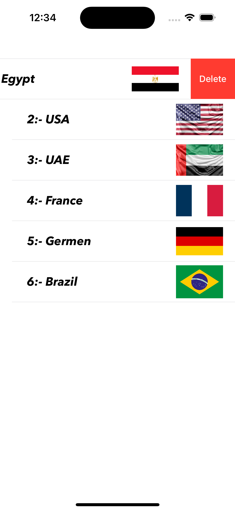
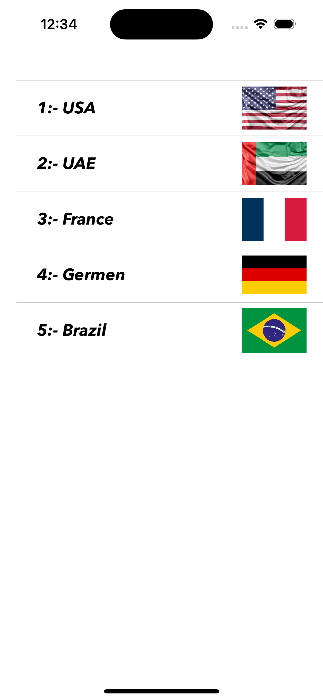

# 🌍 TableViewPractice – iOS App with UITableView & Custom Popup

An educational iOS app demonstrating how to display a list of countries using `UITableView` with a **custom cell**, handle selection, delete rows, and show a **pop-up details screen** with a flag and country name.

---

## 🧠 Project Overview

This project displays a list of countries with their corresponding flags using a table view. When a row is selected, a modal popup appears showing more details. The app also supports deleting rows interactively.

---

## ✨ Features

- ✅ Display country names and flags using a `UITableView`
- ✅ Use of custom `UITableViewCell` via XIB
- ✅ Tap a row to show a full-screen modal pop-up
- ✅ Pass data (flag + name) from table to pop-up
- ✅ Dismiss pop-up by tapping anywhere
- ✅ Swipe-to-delete support with live data update
- ✅ Image and data arrays synced

---

## 📁 Project Structure

| File                          | Purpose                                      |
|------------------------------|----------------------------------------------|
| `CountriesViewController.swift` | Main screen with `UITableView`              |
| `CountryTableViewCell.swift`    | Custom table cell UI with flag & name       |
| `CountryPopUpDetailsVC.swift`  | Pop-up view controller for showing details  |

---

## 🧪 Screenshots

<p align="center">
  
  
  
  
</p>

> Make sure you include your `Screenshots` folder in your GitHub repo with the correct image names.

---

## 🛠 Technologies Used

- Swift 5
- UIKit
- UITableView
- Custom UITableViewCell (XIB)
- Modal Presentation
- Tap Gesture Recognizer
- Array Manipulation
- User Interaction & Navigation

---

## 🚀 How to Run the App

1. Clone the repo:
   ```bash
   git clone https://github.com/your-username/TableViewPractice.git

---

## 👨‍💻 Developed By

**Beshoy Atef**  
📆 July 2025

---

> This project is ideal for beginners learning iOS local persistence and input validation using UIKit.


